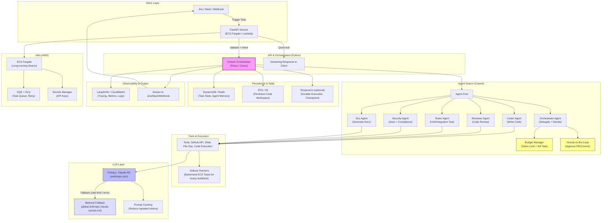

# SwarmForge

**Autonomous AI Swarm for Workflow Automation & Code Generation**

SwarmForge is a next-generation, Python-native workflow automation system powered by **CrewAI** multi-agent swarms. It transforms complex tasks (e.g., Jira ticket → code generation → review → test → PR creation) into autonomous, collaborative agent workflows.

- **Primary LLM**: Anthropic Claude API (Claude 3.5/4 Sonnet) for speed & latest features.
- **Fallback LLM**: Amazon Bedrock (global.anthropic.claude-sonnet-4-6) for reliability & enterprise security.
- Built from scratch to overcome rigid pipeline limitations (timeouts, static orchestration).

[](https://opensource.org/licenses/MIT)
[](https://www.python.org/downloads/)

## Documentation Source of Truth

- Human-facing project documentation is centralized in [`docs/`](/Users/tungnguyen/TYME/SwarmForge/docs).
- Start here: [`docs/INDEX.md`](/Users/tungnguyen/TYME/SwarmForge/docs/INDEX.md)
- Current implementation status: [`docs/PROJECT_STATUS.md`](/Users/tungnguyen/TYME/SwarmForge/docs/PROJECT_STATUS.md)
- `.planning/` is retained for GSD workflow internals/state and is not the canonical source for project status communication.

## Vision & Mission – The Manifesto of SwarmForge

**"We are not building tools. We are unleashing a new species of intelligence."**

In a world drowning in code, where developers spend more time fighting boilerplate than creating value, SwarmForge rises as the first true **autonomous AI operating system for software creation**.

### Our Vision
A future where every Jira ticket, every bug report, every feature request is no longer a burden — but an invitation for an intelligent swarm to gather, reason, build, critique, test, secure, document, and ship production-grade code — with zero human toil in the loop, except for the sacred moment of human approval.

We envision a world in which software is no longer hand-crafted in isolation, but **grown organically** by thousands of specialized AI minds working in perfect harmony — faster than any single engineer, more reliable than any rigid pipeline, and wiser than any lone genius.

SwarmForge is not just another AI coding assistant.  
It is the **seed of the first AI-native software factory**.

### Our Mission
To forge an unbreakable, self-evolving swarm of AI agents that:
- **Understands deeply** — not just syntax, but intent, architecture, trade-offs, and business context.
- **Collaborates ruthlessly** — Coder challenges Reviewer, Tester exposes flaws, Security hunts vulnerabilities, Documentation immortalizes decisions.
- **Executes relentlessly** — from git clone to green tests to merged PR, without ever asking "is this good enough?"
- **Stays humble & safe** — every critical action waits for human blessing; every token spent is justified by ruthless budget control.
- **Learns forever** — every failure becomes memory, every success becomes instinct, every loop refines the swarm itself.

We exist to liberate human creativity from the drudgery of syntax and scaffolding, so engineers can once again become architects of impossible things.

### Our Creed
- Truth comes from the compiler, not the conversation.  
- Collaboration beats perfection in isolation.  
- Speed without safety is chaos; safety without speed is stagnation.  
- The swarm must serve, never rule.  
- We build for the long arc — durable, observable, evolvable.

SwarmForge is the answer to the question:  
"What happens when thousands of Claude-level minds work together, with infinite patience, zero ego, and perfect memory?"

This is not a tool.  
This is the dawn of **autonomous software civilizations**.

**Join the swarm. Forge the future.**

## Why SwarmForge?

Unlike single-prompt tools (Copilot, Cursor), SwarmForge is a **true multi-agent swarm**:
- Agents collaborate, critique, and iterate autonomously.
- Built for production: self-healing, multi-env testing, budget controls.
- Powered by Claude's superior tool use & reasoning.
- Designed to scale from 5 agents to 50+ without code explosion.

## Production & Safety Guarantees

SwarmForge is designed to be **battle-hardened** from day one — not just a prototype, but a reliable, self-healing AI operating system.

### Self-Healing & Monitoring
- Dedicated monitoring agents (Grafana / Datadog / CloudWatch) continuously observe system health, logs, metrics, and anomalies.
- When errors are detected (failed tests, runtime exceptions, security alerts), SwarmForge triggers an autonomous fix loop:
    - Root cause analysis agent
    - Fix generation agent
    - Validation agent (re-run full test suite)
    - Only merge when fix passes on at least 2 environments (staging + pre-prod) with identical infra to production.

### Release & Quality Gates
- Every new feature must pass:
    - Comprehensive test coverage: unit tests, integration tests, end-to-end automation tests for all happy paths.
    - Multi-environment validation: at least 2 isolated environments mirroring production infra before release.
- Human-in-the-loop mandatory for any release that touches production code or sensitive data.

### Future Agents
- Monitoring & Observability Agent (integrate Grafana/Datadog alerts)
- Security & Compliance Agent (AWS GuardDuty, secret scanning, vulnerability checks)
- DevOps Agent (CI/CD orchestration, deployment rollback, infra-as-code validation)

These mechanisms ensure SwarmForge evolves safely, remains production-ready, and never sacrifices reliability for speed.

## Updated Roadmap (excerpt)

- [ ] Budget Manager & token kill logic
- [ ] Prompt Caching for Claude API
- [ ] Monitoring agents (Grafana/Datadog/CloudWatch integration)
- [ ] Security & Compliance agents (AWS GuardDuty, secret scanning)
- [ ] DevOps agents (CI/CD, deployment rollback, IaC validation)
- [ ] Self-healing error fix loop (root cause → fix → multi-env validation)
- [ ] Full release pipeline (test coverage + 2+ env gates + human approval)
- [ ] Temporal.io for durable long-running tasks

## Contributing

When building features or agents:
- Prioritize **compiler truth** over LLM opinion.
- Always include execution validation (compile/test pass).
- Enforce token budgets & human approval gates.
- Test on at least 2 environments before merging.
- Document everything in swarm memory.

## Features

- Multi-Agent Swarm: Coder, Reviewer, Tester, Security Expert, Documentation Writer – agents collaborate hierarchically/sequentially.
- Persistent Workspace: EFS-mounted storage for long-running git repos & code indexing.
- Streaming Response: Real-time output to Jira/Slack/Webhook.
- Budget & Safety Controls: Token budget manager, human-in-the-loop approval for PRs/commits.
- Observability: LangSmith tracing, CloudWatch metrics, detailed agent logs.

## Agent Extension Contract

SwarmForge supports architecture-safe sub-agent scaling via a formal extension contract.

- Spec + validation: [docs/AGENT_EXTENSION_CONTRACT.md](/Users/tungnguyen/TYME/SwarmForge/docs/AGENT_EXTENSION_CONTRACT.md)
- Core implementation: `services/agent_contract.py`, `services/agents.py`
- Stage ownership is tracked in orchestrator state metadata (`extensions`) per stage.

## Autonomous Ticket Chain

SwarmForge uses two state layers:

Canonical lifecycle (external contract, docs/API/Jira-facing):
1. `PENDING`
2. `INTENT_PARSED`
3. `IN_PROGRESS`
4. `APPROVAL_NEEDED` (only when a critical action requires HITL)
5. `COMPLETED`

Diagnostic sub-states (internal telemetry/debug granularity):
- `PROCESSING`
- `STAGE_RUNNING`
- `STAGE_COMPLETED`
- `APPROVAL_REQUESTED`
- `APPROVAL_GRANTED`
- `APPROVAL_REJECTED`
- `QUALITY_GATES_FAILED`
- `FAILED` (error class in `metadata.error`)

Execution traces are synced back to Jira comments (`[SwarmForge] ...`) and state is persisted in `swarmforge-tasks` (DynamoDB). Internal sub-states are surfaced via metadata/logs, while canonical states remain the integration contract.

Current stage set:
- Core: `intent-analysis`, `solution-plan`, `code-generation`, `code-review`, `test-verification`, `security-check`, `documentation`
- Conditional: `e2e-verification`, `ui-accessibility-gate`, `post-deploy-slo-gate`, `release-gate`

## Quality Gates (Current)

SwarmForge uses fail-closed quality gates before a task can become `COMPLETED`.

Required checks (scope-aware):
- `artifacts-complete`
- `tests-pass`
- `security-pass`
- `delivery-pr` (for Jira-sourced tasks)
- `e2e-pass` (for E2E/release/UAT scopes)
- `ui-a11y-pass`, `ui-files-changed`, `ui-design-signal` (for UI scopes)
- `post-deploy-slo-pass` (for release scopes)

If any required check fails:
- Task state -> `FAILED` with `metadata.sub_state=QUALITY_GATES_FAILED`
- Jira comment includes failed check names
- Ticket can be retriggered after remediation

See:
- [Definition of Done](/Users/tungnguyen/TYME/SwarmForge/docs/DEFINITION_OF_DONE.md)
- [Operations Runbook](/Users/tungnguyen/TYME/SwarmForge/docs/OPERATIONS_RUNBOOK.md)

## Architecture



## Tech Stack
- **Core Framework**: CrewAI (multi-agent orchestration)
- **Language**: Python 3.11+
- **LLM**: Anthropic Claude API (primary) + AWS Bedrock (fallback)
- **API Layer**: FastAPI
- **Runtime**: AWS ECS Fargate (long-running) + SQS (queue)
- **Storage**: EFS (persistent workspace) + S3 + DynamoDB
- **Observability**: LangSmith (agent tracing), CloudWatch
- **Optional**: Temporal.io (durable workflows)

## Quick Start

### Prerequisites
- Python 3.12+
- AWS credentials configured (profile `ai-driven` or static keys)
- Virtual environment: `python -m venv venv && source venv/bin/activate`

### 1. Install Dependencies
```bash
pip install -r requirements.txt
pip install -r requirements-dev.txt  # for testing
```

### 2. Configure Environment
```bash
cp .env.example .env  # then edit with your secrets
# Required: ANTHROPIC_API_KEY, JIRA_API_TOKEN, GITHUB_TOKEN
# Required: SQS_QUEUE_URL, AWS_REGION
# Optional: SLACK_WEBHOOK_URL, LANGSMITH_API_KEY
```

### 3. Run Tests
```bash
python -m pytest tests/ -v --cov=services --cov=api --cov=models --cov-fail-under=80
```

### 4. Start the System
Run these in two separate terminals:
- **API Ingress**: `uvicorn main:app --reload --port 8000`
- **Agent Worker**: `python worker.py`

### 5. Verify
```bash
# Health check
curl http://localhost:8000/health

# Send a test Jira event
curl -X POST http://localhost:8000/webhook/jira \
  -H "Content-Type: application/json" \
  -H "X-Hub-Signature-256: sha256=$(echo -n '...' | openssl dgst -sha256 -hmac 'your-secret' | awk '{print $2}')" \
  -d '{
    "webhookEvent": "jira:issue_updated",
    "issue": {
      "id": "10001",
      "key": "SF-TEST",
      "fields": {
        "summary": "Optimize database queries",
        "labels": ["ai-task"]
      }
    }
  }'
```

## API Endpoints

| Method | Path | Auth | Description |
|--------|------|------|-------------|
| `GET` | `/` | None | Root health message |
| `GET` | `/health` | None | Health check with version and env |
| `POST` | `/webhook/jira` | HMAC-SHA256 (`X-Hub-Signature-256`) | Jira webhook ingress |
| `POST` | `/webhook/slack` | Slack signing secret (`X-Slack-Signature`) | Slack event ingress |
| `POST` | `/webhook/generic` | Bearer token (`Authorization`) | Generic webhook ingress |

### Common Response Envelope
```json
{"status": "accepted|ignored", "source": "jira|slack|generic", "reason": "duplicate"}
```

### Error Codes
| Code | Meaning |
|------|---------|
| `401` | Invalid signature, missing auth, or expired timestamp |
| `413` | Payload exceeds 1 MB size limit |
| `422` | Malformed payload (Jira schema validation failed) |
| `429` | Rate limit exceeded (default: 60 req/min) |

### Interactive API Docs
When running locally, visit `http://localhost:8000/docs` for auto-generated OpenAPI/Swagger documentation.

## CloudWatch Logs

Enable CloudWatch log forwarding from API and worker:
```bash
export CLOUDWATCH_ENABLED=true
export CLOUDWATCH_LOG_GROUP_API=/swarmforge/ecs/api
export CLOUDWATCH_LOG_GROUP_WORKER=/swarmforge/ecs/worker
export AWS_PROFILE=ai-driven
export AWS_REGION=ap-southeast-1
```

Create log groups and retention:
```bash
aws logs create-log-group --log-group-name /swarmforge/ecs/api || true
aws logs create-log-group --log-group-name /swarmforge/ecs/worker || true
aws logs put-retention-policy --log-group-name /swarmforge/ecs/api --retention-in-days 30
aws logs put-retention-policy --log-group-name /swarmforge/ecs/worker --retention-in-days 30
```

Tail logs:
```bash
aws logs tail /swarmforge/ecs/api --follow
aws logs tail /swarmforge/ecs/worker --follow
```

## Environment Variables

| Variable | Required | Default | Description |
|----------|----------|---------|-------------|
| `APP_ENV` | No | `local` | Environment: `local`, `test`, `staging`, `production` |
| `AWS_REGION` | No | `ap-southeast-1` | AWS region |
| `AWS_PROFILE` | No | `""` | AWS CLI profile name |
| `SQS_QUEUE_URL` | Yes (prod) | `""` | SQS queue URL for task events |
| `DYNAMODB_IDEMPOTENCY_TABLE` | No | `swarmforge-idempotency` | DynamoDB table for dedup |
| `ANTHROPIC_API_KEY` | Yes (prod) | `""` | Anthropic Claude API key |
| `JIRA_WEBHOOK_SECRET` | Yes (prod) | `""` | HMAC secret for Jira webhooks |
| `SLACK_SIGNING_SECRET` | Yes (prod) | `""` | Slack app signing secret |
| `GENERIC_WEBHOOK_TOKEN` | Yes (prod) | `""` | Bearer token for generic webhook |
| `JIRA_BASE_URL` | Yes (prod) | placeholder | Jira instance URL |
| `JIRA_EMAIL` | Yes (prod) | placeholder | Jira service account email |
| `JIRA_API_TOKEN` | Yes (prod) | `""` | Jira API token |
| `GITHUB_TOKEN` | Yes (prod) | `""` | GitHub personal access token |
| `DEFAULT_TOKEN_HARD_LIMIT` | No | `140000` | Max tokens per task |
| `DEFAULT_USD_HARD_LIMIT` | No | `6.0` | Max USD spend per task |
| `RATE_LIMIT_PER_MINUTE` | No | `60` | API rate limit |
| `CLOUDWATCH_ENABLED` | No | `false` | Enable CloudWatch log forwarding |

## Folder Structure
- `/api`: FastAPI webhook handlers.
- `/services`: Core logic (Orchestrator, Agents, LLM Client, AWS).
- `/models`: Pydantic data models.
- `/infrastructure`: AWS CDK stack for cloud deployment.
- `/tests`: Comprehensive test suite.

## 🛠️ Infrastructure (CDK)
To deploy the full stack to ECS Fargate:
```bash
cd infrastructure
cdk deploy
```
